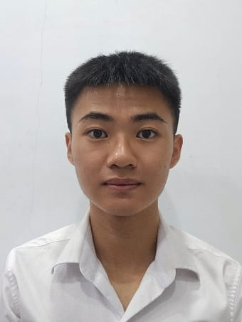
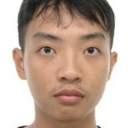

We are a team based in the [School of Computing, National University of Singapore](https://www.comp.nus.edu.sg).

## Project team

### Cheh Jun Xian

[[github](https://github.com/junxiancheh)]

* Role: Developer
* Responsibility: Testing

### Liao Yantong

[[github](http://github.com/LiaoYantong)]

* Role: Developer
* Responsibilities: Code quality

### Lim Zi En

[[homepage](https://github.com/AY2526S2-CS2103T-T14-4)]
[[github](https://github.com/0Nly)]

* Role: Developer
* Responsibilities: Docs

### Ng Zhe, Javier

[[github](https://github.com/javnz1)]

* Role: Developer
* Responsibilities: Testing
